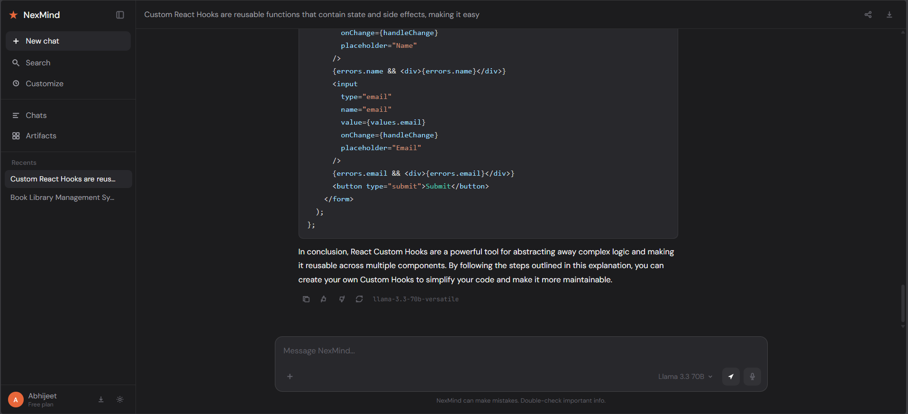
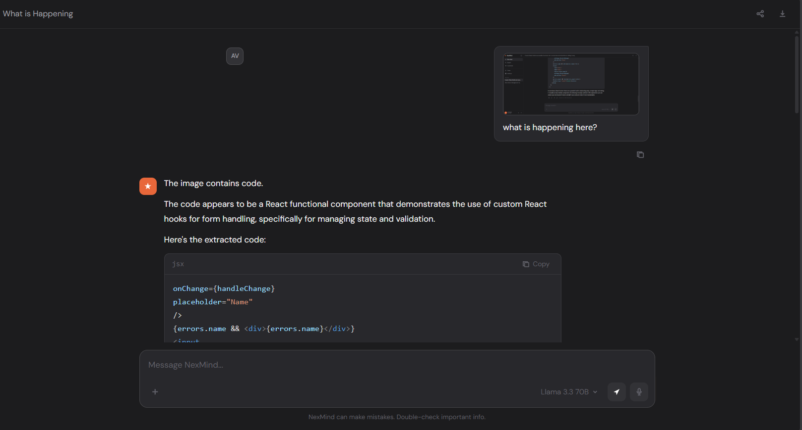

# NexMind — AI Assistant Platform

> A production-grade, browser-based AI assistant with real-time streaming, web search, persistent memory, vision understanding, and smart multi-model routing. Built from scratch with React + Node.js + Express, deployed on Railway and Vercel.




---

## Live Demo

- **Frontend:** [nexmind.vercel.app](https://nexmind.vercel.app)

---

## What is NexMind?

NexMind is a self-hosted AI assistant platform that rivals commercial tools like ChatGPT — built entirely with open source models and free APIs. It classifies every query automatically and routes it to the best available model, giving you the right tool for every task without switching apps.

---

## Features

- **Streaming responses** — words appear token by token in real time, just like ChatGPT
- **Web search** — automatically searches the internet for current events, news, and real-time data via Tavily API
- **Persistent memory** — remembers your name, projects, and preferences across sessions via Mem0
- **Image understanding** — upload screenshots, code photos, UI designs — AI analyzes them
- **Smart routing** — detects whether you're asking a coding, reasoning, or general question and picks the best model
- **Auto-title** — AI generates a descriptive title for every conversation from the first message
- **Prompt templates** — pre-built templates for common developer tasks (fix code, review code, design system)
- **Regenerate** — one click to get a fresh AI response if you're not satisfied
- **Multi-session** — create and switch between multiple conversations
- **Download** — export any conversation as a text file
- **Mobile responsive** — works on any screen size

---

## Tech Stack

### Backend
| Technology | Purpose |
|---|---|
| Node.js + Express | REST API server |
| Groq API | LLM inference — Llama 3.3 70B, DeepSeek-R1 |
| Tavily API | Real-time web search |
| Mem0 API | Persistent memory across sessions |
| Multer | File/image upload handling |
| CORS | Cross-origin request handling |

### Frontend
| Technology | Purpose |
|---|---|
| React 18 | UI framework |
| React Markdown | Render AI markdown responses |
| React Syntax Highlighter | Code block syntax highlighting |
| CSS Variables | Dark theme design system |
| DM Sans + JetBrains Mono | Typography |

### Infrastructure
| Technology | Purpose |
|---|---|
| Railway | Backend hosting (always-on free tier) |
| Vercel | Frontend hosting (CDN + CI/CD) |
| GitHub Actions | CI/CD pipeline |

---

## Architecture

```
Browser (React)
      |
      | HTTPS
      ↓
Express Backend (Railway)
      |
      ├── POST /chat ──────────→ LiteLLM Router
      │                              |
      │                    ┌─────────┼──────────┐
      │                    ↓         ↓          ↓
      │               Llama 70B  DeepSeek-R1  Search
      │               (general)  (reasoning)  (Tavily)
      │
      ├── POST /chat/vision ──→ Llama 4 Scout (vision)
      ├── POST /chat/title ───→ Llama 70B (title gen)
      ├── Memory Layer ────────→ Mem0 (recall + save)
      └── GET /health ─────────→ status check
```

### Query Routing Logic

```
User sends message
      ↓
Classifier (utils/classifier.js)
      ↓
Contains "code/bug/function/debug" → DeepSeek-R1 (coding)
Contains "news/latest/today/search" → Llama 70B + Tavily (search)
Contains "reason/math/solve/analyze" → DeepSeek-R1 (reasoning)
Everything else → Llama 3.3 70B (general)
```

---

## Project Structure

```
my-ai-assistant/               ← Backend (Node.js)
├── server.js                  ← Express entry point
├── routes/
│   └── chat.js                ← All chat endpoints
├── utils/
│   ├── classifier.js          ← Query type detection
│   ├── systemPrompt.js        ← AI personality + standards
│   └── tools.js               ← Plugin utilities
├── .env                       ← Environment variables (never commit)
└── package.json

nexmind/                       ← Frontend (React)
├── src/
│   ├── components/
│   │   ├── Sidebar.jsx        ← Navigation + chat history
│   │   ├── ChatArea.jsx       ← Main chat window
│   │   ├── Message.jsx        ← Individual message + markdown
│   │   └── InputBar.jsx       ← Text input + tools
│   ├── context/
│   │   └── ChatContext.jsx    ← Global state management
│   └── utils/
│       └── api.js             ← API calls to backend
└── package.json
```

---

## Getting Started

### Prerequisites

- Node.js 20+
- npm or yarn
- Free accounts at: Groq, Tavily, Mem0

### 1. Clone the repository

```bash
git clone https://github.com/xx-abhijeet-xx/my-ai-assistant.git
cd my-ai-assistant
```

### 2. Install backend dependencies

```bash
npm install
```

### 3. Configure environment variables

```bash
cp .env.example .env
```

Open `.env` and fill in your API keys:

```env
GROQ_API_KEY=your_groq_api_key
TAVILY_API_KEY=your_tavily_api_key
MEM0_API_KEY=your_mem0_api_key
PORT=8080
```

### 4. Start the backend

```bash
npm start
```

Backend runs at `http://localhost:8080`

### 5. Install frontend dependencies

```bash
cd ../nexmind
npm install
```

### 6. Configure frontend environment

```bash
cp .env.example .env.local
```

```env
REACT_APP_API_URL=http://localhost:8080
REACT_APP_USER_ID=your_name
```

### 7. Start the frontend

```bash
npm start
```

Frontend runs at `http://localhost:3000`

---

## API Reference

### POST /chat
Send a message and receive a streaming response.

**Request:**
```json
{
  "message": "How do I fix a memory leak in React?",
  "userId": "abhijeet",
  "history": []
}
```

**Response:** Server-Sent Events stream
```
data: {"token": "The"}
data: {"token": " issue"}
data: {"token": " is..."}
data: {"done": true, "model": "llama-3.3-70b-versatile", "queryType": "coding"}
```

---

### POST /chat/vision
Analyze an image with text prompt.

**Request:** `multipart/form-data`
- `image` — image file (jpg, png, webp)
- `message` — text prompt
- `history` — JSON stringified conversation history

**Response:**
```json
{
  "response": "The image shows a React component with a bug on line 23...",
  "model": "meta-llama/llama-4-scout-17b-16e-instruct"
}
```

---

### POST /chat/title
Generate a short title from a message.

**Request:**
```json
{ "message": "How do I implement JWT auth in Spring Boot?" }
```

**Response:**
```json
{ "title": "JWT Auth Spring Boot" }
```

---

### GET /health
Health check endpoint.

**Response:**
```json
{
  "status": "running",
  "message": "AI Assistant API is live"
}
```

---

## Environment Variables

| Variable | Description | Required | Example |
|---|---|---|---|
| `GROQ_API_KEY` | Groq API key for LLM inference | Yes | `gsk_abc...` |
| `TAVILY_API_KEY` | Tavily search API key | Yes | `tvly-abc...` |
| `MEM0_API_KEY` | Mem0 memory API key | Yes | `m0-abc...` |
| `PORT` | Server port | No | `8080` |

---

## Deployment

### Backend — Railway

```bash
# Install Railway CLI
npm install -g @railway/cli

# Login and deploy
railway login
railway init
railway up
```

Add environment variables in Railway dashboard → Variables tab.

### Frontend — Vercel

```bash
# Install Vercel CLI
npm install -g vercel

# Deploy
cd nexmind
vercel
```

Add `REACT_APP_API_URL` pointing to your Railway URL in Vercel dashboard → Settings → Environment Variables.

---

## Models Used

| Model | Provider | Used For | Cost |
|---|---|---|---|
| Llama 3.3 70B | Groq | General chat, web search | Free |
| DeepSeek-R1 Distill | Groq | Coding, reasoning | Free |
| Llama 4 Scout 17B | Groq | Vision/image analysis | Free |

---

## What I Learned

Building NexMind taught me:

- **Streaming APIs** — implementing Server-Sent Events end to end from Express to React
- **LLM routing** — how to classify queries and route to specialized models
- **RAG concepts** — integrating real-time search into AI context
- **Fine-tuning** — creating JSONL training datasets, running QLoRA on free GPUs
- **Prompt engineering** — writing system prompts that shape AI personality and behavior
- **Production deployment** — Railway, Vercel, environment management, CI/CD

---

## Roadmap

- [ ] User authentication (JWT login/signup)
- [ ] PDF file upload and analysis
- [ ] GitHub plugin integration
- [ ] Wikipedia plugin
- [ ] Code execution sandbox
- [ ] Mobile app (React Native)
- [ ] Multiple AI model switcher in UI

---

## Author

**Abhijeet Verma** — Full Stack Engineer at LTIMindtree

- GitHub: [@xx-abhijeet-xx](https://github.com/xx-abhijeet-xx)
- LinkedIn: [abhijeet-verma-dev](https://linkedin.com/in/abhijeet-verma-dev)
- Portfolio: [abhijeet-verma.vercel.app](https://abhijeet-verma.vercel.app)
- Email: contact.abhijeetverma@gmail.com

---

## License

MIT — free to use, modify, and distribute.

---

> Built with curiosity, caffeine, and a lot of debugging. 🚀